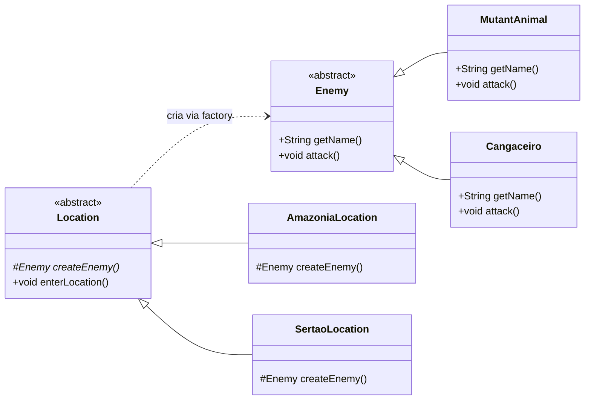

# Diagrama de Classes — Factory Method

## Mapeamento do Padrão

| Papel no padrão    | Classe no jogo       | Responsabilidade                                                        |
|--------------------|-----------------------|--------------------------------------------------------------------------|
| **Product**        | `Enemy` (abstract)   | Interface comum dos inimigos: `getName()` e `attack()`                  |
| **ConcreteProduct**| `MutantAnimal`, `Cangaceiro` | Implementações concretas com nome e ataque próprios              |
| **Creator**        | `Location` (abstract)| Factory method `createEnemy()` + template method `enterLocation()`      |
| **ConcreteCreator**| `AmazoniaLocation`, `SertaoLocation` | Implementam `createEnemy()` retornando o inimigo da região|

## Diagrama

> `createEnemy()` é abstrato em `Location` — cada `ConcreteCreator` fornece sua própria implementação.

## Extensibilidade

Para adicionar uma nova localização (ex: Rio de Janeiro), basta criar:
- `Criminal extends Enemy`
- `RioDeJaneiroLocation extends Location`

Nenhuma alteração no código existente é necessária.